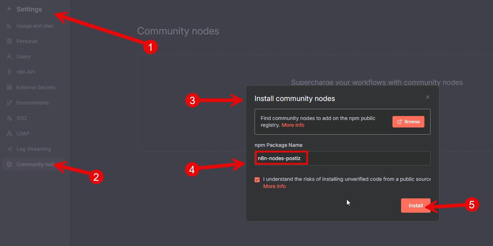

# Introduction
[Nushir](https://nushir.com) is a powerful social media scheduling tool that allows you to manage your social media accounts efficiently.

You can use n8n to automate your workflow and post to multiple social media platforms at once.

You can [self-host](https://docs.nushir.com/introduction) Nushir or use our [cloud version](https://platform.nushir.com).
For example: Load news from Reddit >> Make it a video with AI >> Post it to your social media accounts.

Nushir supports: X, LinkedIn, BlueSky, Instagram, Facebook, TikTok, YouTube, Pinterest, Dribbble, Telegram, Discord, Slack, Threads, Lemmy, Reddit, Mastodon, Warpcast, Nostr and VK.

You can learn how to use Nushir + n8n after installation here:
https://youtu.be/c50u3K3xsCI

---

> Note
> If you are self-hosting Nushir on port 5000 (reverse proxy),
> Your host must end with /api for example:
> http://yourdomain.com/api

Alternatively, you can use the SDK with curl, check the [Nushir API documentation](https://docs.nushir.com/public-api) for more information.

---

## Installation (quick installation)

- Click on settings
- Click on Community Nodes
- Click on Install
- Add "n8n-nodes-nushir" to "npm Package Name"
- Click on Install



---

## Installation (non-docker - manual installation)
Go to your n8n installation usually located at `~/.n8n`.
Check if you have the `custom` folder, if not create it and create a new package.json file inside.
```bash
mkdir -p ~/.n8n/custom
npm init -y
```

Then install the Nushir node package:
```
npm install n8n-nodes-nushir
```

## For docker users (manual installation)
Create a new folder on your host machine, for example `~/n8n-custom-nodes`, and create a new package.json file inside:
```bash
mkdir -p ~/n8n-custom-nodes
npm init -y
```

install the Nushir node package:
```bash
npm install n8n-nodes-nushir
```

When you run the n8n docker container, mount the custom nodes folder to the container:
Add the following environment variable to your docker run command:
```
N8N_CUSTOM_EXTENSIONS="~/n8n-custom-nodes"
```
